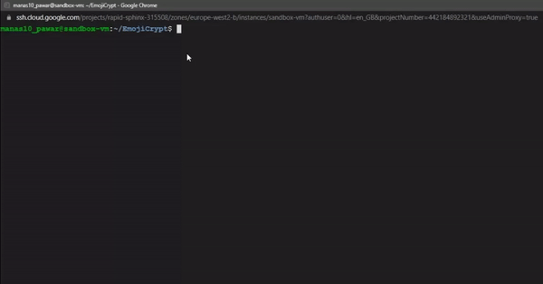

# EmojiCrypt

AES encryption encoded using emojis



- EmojiCrypt's output can be effectively copied to the clipboard in some CLIs only

| Command Line Interface                             | Copyable |
| -------------------------------------------------- | -------- |
| Google Cloud Engine VM Instance (SSH via browser)  | ✔️       |
| Linux terminal (Ubuntu 20.04LTS)                   | ✔️       |
| Command prompt (Windows 10)                        | ❌       |
| Windows Terminal (Windows 10)                      | ✔️       |
| Docker Playground                                  | ❌       |

- Text file encryption uses Vigenere's cipher instead of AES cipher because AES is computationally expensive and not suitable for large files. The output of Vigenere's cipher is also encoded using emojis.

## Use as a python module
Install the module using <code>pip install emojicrypt</code>

```python
from emojicrypt import EmojiCrypt

keyword = str(input("Enter keyord:"))
cipher = EmojiCrypt(keyword)

cipher.encrypt(str(input("\nEnter plain text: ")))
cipher.decrypt(str(input("\nEnter cipher text: ")))
```

## Use from a command line
```
python -m venv env
source env/bin/activate
pip install -r requirements.txt

python emojicrypt.py 
```

## Disclaimer:

_Under no circumstances will the creator/s of this application be held responsible or liable in any way for any claims, damages, losses, expenses, costs or liabilities whatsoever (including, without limitation, any direct or indirect damages for loss of profits, business interruption or loss of information) resulting or arising directly or indirectly from your use of or inability to use this application even if the creator/s of this application have been advised of the possibility of such damages in advance._

### Made with lots of ⏱️, 📚 and ☕ by [InputBlackBoxOutput](https://github.com/InputBlackBoxOutput)
