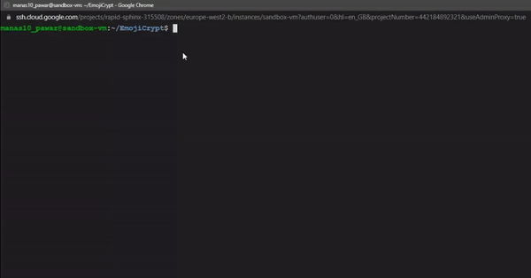

# EmojiCrypt

AES encryption encoded using emojis

- EmojiCrypt's output can be effectively copied to the clipboard in some CLIs only

| Command Line Interface                             | Copyable |
| -------------------------------------------------- | -------- |
| Google Cloud Engine VM Instance (SSH via browser)  | ✔️       |
| Linux terminal (Ubuntu 20.04LTS)                   | ✔️       |
| Command prompt (Windows 10)                        | ❌       |
| Windows Terminal (Windows 10)                      | ✔️       |

- Text file encryption uses Vigenere's cipher instead of AES cipher

## Usage

### Usage as a python module
Install the module using <code>pip install emojicrypt</code>

<code>
from emojicrypt import EmojiCrypt

keyword = str(input("Enter keyord:"))
cipher = EmojiCrypt(keyword)

cipher.encrypt(str(input("\nEnter plain text: ")))
cipher.decrypt(str(input("\nEnter cipher text: ")))
</code>

### Usage on a Command Line Interface (CLI)

<code> emojicrypt.py [-h] [-k K] (-e E | -d D | -ef EF | -df DF) </code>

| Option     | Description                    |
| ---------- | ------------------------------ |
| -k         | Keyword                        |
| -e         | Encrypt text                   |
| -d         | Decrypt text                   |
| -ef        | Encrypt file                   |
| -df        | Decrypt file                   |
| -h, --help | show the help message and exit |

## Usage by creating container from docker image

Run the following command: <code> docker run -it --rm rutuparn/emojicrypt </code>

**Note**: The docker image supports only text input

## Disclaimer:

_Under no circumstances will the creator/s of this application be held responsible or liable in any way for any claims, damages, losses, expenses, costs or liabilities whatsoever (including, without limitation, any direct or indirect damages for loss of profits, business interruption or loss of information) resulting or arising directly or indirectly from your use of or inability to use this application even if the creator/s of this application have been advised of the possibility of such damages in advance._

### Made with lots of ⏱️, 📚 and ☕ by [InputBlackBoxOutput](https://github.com/InputBlackBoxOutput)
